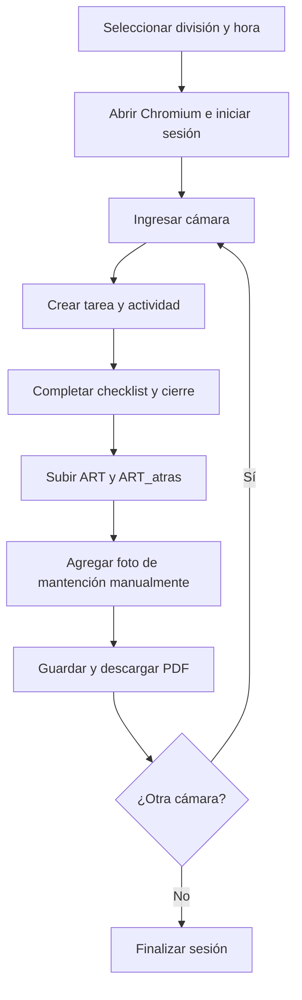

# 🚀 CCTVFlow

> Automatización asistida de mantenciones preventivas de cámaras CCTV en
> PSINet.

CCTVFlow es una herramienta en Python que automatiza el trabajo administrativo
posterior a una mantención preventiva: crea la tarea y su actividad, completa el
checklist, adjunta las fotografías de la ART, guarda el registro y descarga el
informe PDF generado por PSINet.

El navegador se mantiene visible durante la ejecución para que el usuario pueda
supervisar el proceso e intervenir cuando sea necesario.

## Objetivo

Reducir el tiempo dedicado a tareas repetitivas en PSINet, minimizar errores de
digitación y mantener un flujo trazable desde las evidencias fotográficas hasta
el informe final.

## Estado actual

El motor principal se ejecuta con:

```bash
python -m psinet_auto_manual
```

Actualmente permite:

- iniciar Chromium e ingresar a PSINet con credenciales locales;
- seleccionar la división antes de comenzar;
- trabajar con `DCH-SUBTE` y `DRT`;
- crear tareas de mantención programada y sus actividades;
- asignar horarios consecutivos de 10 minutos;
- buscar y seleccionar la cámara correspondiente;
- seleccionar participantes configurados;
- completar Estado General y Conexiones;
- configurar APR y equipo alza hombre;
- adjuntar automáticamente `ART` y `ART_atras`;
- dejar disponible un campo para cargar manualmente la foto de la mantención;
- guardar la actividad y descargar el PDF en `downloads/pdfs/`;
- procesar varias cámaras dentro de una misma sesión.

> [!IMPORTANT]
> El flujo de DRT continúa en validación en PSINet. El selector dinámico del
> bloque **CONEXIONES** ya fue implementado para evitar depender de IDs fijos,
> pero debe verificarse de extremo a extremo antes de considerarlo estable.

## Flujo actual



También existe un flujo de preparación de evidencias a partir del nombre de las
fotografías:

```text
automatizacion/fotos/
        ↓
lector_fotos.py
        ↓
automatizacion/evidencias.json
        ↓
automatizacion/generar_plan_desde_fotos.py
        ↓
automatizacion/plan_ejecucion.json
```

El menú `python -m automatizacion.menu_psinet` permite buscar cámaras, elegir un
sector y previsualizar horarios. Por ahora genera solamente la planificación:
todavía no inicia Playwright.

## Divisiones y catálogos

Las divisiones disponibles se definen en
`automatizacion/data/config.py`:

| División | Catálogo |
| --- | --- |
| `DCH-SUBTE` | `automatizacion/data/sectores.json` |
| `DRT` | `automatizacion/data/sectores_drt.json` |

El catálogo de DRT contiene 156 cámaras distribuidas en 11 áreas. Los nombres
deben coincidir exactamente con los mostrados por PSINet.

## Fotografías

Las imágenes permanentes de la ART deben estar en:

```text
automatizacion/data/art/
├── ART.jpg
└── ART_atras.jpg
```

Se admiten extensiones `.jpg`, `.jpeg` y `.png`.

Para las fotografías de cámaras se utiliza el formato:

```text
<nombre_camara>_<correlativo>.jpg
```

Ejemplo:

```text
20740_Cruce_Rampa_4_0001.jpg
```

## Estructura principal

```text
camara_cctv_psinet/
├── automatizacion/
│   ├── data/
│   │   ├── art/
│   │   ├── config.py
│   │   ├── sectores.json
│   │   └── sectores_drt.json
│   ├── fotos/
│   ├── generar_plan_desde_fotos.py
│   └── menu_psinet.py
├── downloads/
│   └── pdfs/
├── psinet/
│   ├── descargas.py
│   ├── login.py
│   ├── navegador.py
│   └── tareas.py
├── utils/
├── lector_fotos.py
├── psinet_auto_manual.py
├── requirements.txt
└── todo.md
```

## Instalación

### 1. Clonar el repositorio

```bash
git clone https://github.com/gingofet/camara_cctv_psinet.git
cd camara_cctv_psinet
```

### 2. Crear y activar el entorno virtual

```bash
python -m venv .venv
source .venv/bin/activate
```

En PowerShell:

```powershell
python -m venv .venv
.\.venv\Scripts\Activate.ps1
```

### 3. Instalar dependencias

```bash
python -m pip install --upgrade pip
pip install -r requirements.txt
playwright install chromium
```

### 4. Configurar credenciales

Crea un archivo `.env` en la raíz del proyecto:

```dotenv
PSINET_URL=https://suite.apps.psinet.cl/login
PSINET_USER=usuario@ejemplo.cl
PSINET_PASS=contraseña
```

El archivo `.env` está excluido de Git y no debe publicarse.

### 5. Agregar las fotografías de la ART

Guarda las imágenes como:

```text
automatizacion/data/art/ART.jpg
automatizacion/data/art/ART_atras.jpg
```

### 6. Ejecutar

```bash
python -m psinet_auto_manual
```

## Validaciones locales

Compila solamente el código del proyecto para evitar que `compileall` inspeccione
plantillas internas de paquetes instalados en `.venv`:

```bash
python -m compileall -q automatizacion psinet utils \
  lector_fotos.py psinet_auto.py psinet_auto_manual.py
python -m json.tool automatizacion/data/sectores_drt.json > /dev/null
```

## Arquitectura futura

La evolución prevista es una arquitectura híbrida:

- **CCTVFlow Web:** usuarios, roles, dispositivos, trabajos, historial y PDFs.
- **Agente local:** Playwright visible, credenciales PSINet locales, fotografías
  y descarga de informes.
- **Aplicación Android:** captura y nombrado correcto de evidencias en terreno.

El motor Playwright continuará ejecutándose en el equipo del usuario, no en el
servidor.

Consulta el avance y las siguientes tareas en [`todo.md`](todo.md).

## Tecnologías

- Python
- Playwright
- Chromium
- PySide6
- Git y GitHub

## Seguridad

- No publiques `.env`, credenciales, fotografías operacionales ni PDFs.
- Mantén las credenciales de PSINet únicamente en el equipo local.
- Revisa siempre `git status` antes de crear un commit.

## Licencia

Este repositorio no incluye todavía una licencia de uso. El código permanece
bajo los derechos de su autor.
